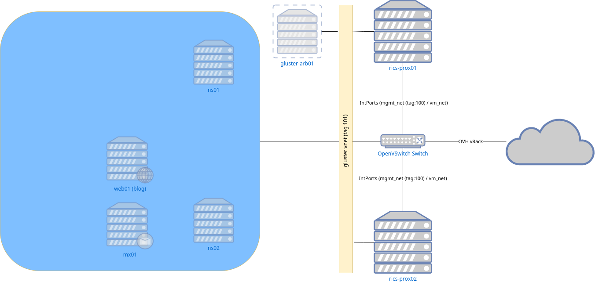

# RI-CS

# Introduction:
Welcome!

This is the project page of the next iteration of the Ri-CS sandbox network.
This project will include some new technologies that I've started to pick up either in professional life or that seemed interesting to learn about.

Currently that means that the following projects are included:
- OpenNebula 
- Terraform
- Puppet

Additionally to be implemented are:
- Ansible / AWX

## Diagram:

## Backstory:
The Ri-CS network, has always been a part where my creativity and eagerness to learn thrived;
It was created during a project called KubeDock (An automated self-managing kubernetes cluster) which failed due to a lack of knowledge and has further evolved to become a sandbox for all my projects.

Ri-CS has hosted, for example a OpenStack Xena cluster before returning to Proxmox for ease of management in times of less time being available.

# To-Do:
## Base infra:
- [ ] Implement selfhosted GitLab (Also for CI/CD)
- [ ] Implement nameservers
- [ ] Implement Puppet
- [ ] Implement MX server(s)

## Terraform:
- [x] Finish implementation of Terraform (provider is capable of correctly managing resources)
- [ ] Write the additional base infrastructure as code:
    - [x] Nameservers
    - [ ] Puppet server

